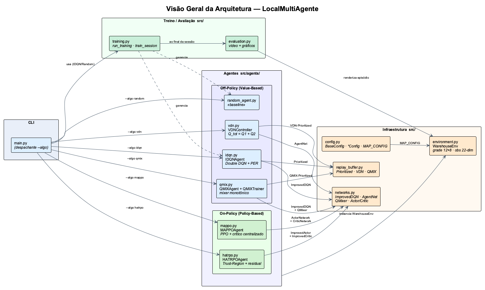
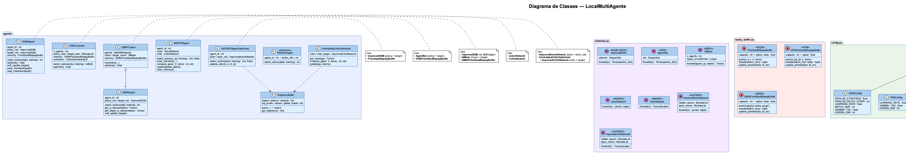
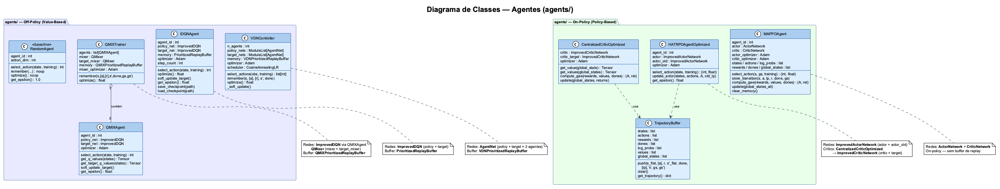

# Warehouse MARL

Projeto de **Aprendizado por Reforço Multi-Agente (MARL)** num ambiente customizado de
"armazém": dois robôs numa grade 12×8 precisam pegar caixas (`A`) e entregá-las nos alvos
(`B`), evitando paredes (`X`) e barreiras (`Y`).

O código original estava espalhado e duplicado em vários scripts e notebooks (em
`Código/`). O diretório [`src/`](src) reúne uma versão **modularizada e reutilizável** do
núcleo, contendo o ambiente e **seis algoritmos**: **IDQN** (Independent Deep Q-Network),
um **baseline aleatório**, **VDN**, **QMIX**, **MAPPO** e **HATRPO**. Cada módulo cita no
cabeçalho o arquivo de origem de onde foi extraído.

## Estrutura

```
src/
├── config.py            # MAP_CONFIG, BaseConfig e *Config de cada algoritmo
├── environment.py       # WarehouseEnv (Gymnasium) + obs por-robô e estado global
├── replay_buffer.py     # PrioritizedReplayBuffer, VDN e QMIX (variantes)
├── networks.py          # ImprovedDQN, AgentNet, QMixer, Actor/Critic (MAPPO/HATRPO)
├── agents/
│   ├── idqn.py          # IDQNAgent (Double-DQN + PER + soft update)
│   ├── random_agent.py  # RandomAgent (baseline)
│   ├── vdn.py           # VDNController (Q_total = Q1 + Q2) + runner
│   ├── qmix.py          # QMIXAgent + QMixer + QMIXTrainer + runner
│   ├── mappo.py         # MAPPOAgent (PPO, crítico centralizado) + runner
│   └── hatrpo.py        # HATRPOAgent + crítico centralizado + runner
├── training.py          # loop value-based multi-sessão (IDQN/Random)
├── evaluation.py        # gravação de vídeo + gráficos consolidados
└── main.py              # interface de linha de comando (dispatch por --algo)
```

> Os scripts/notebooks antigos em `Código/` foram mantidos intactos como referência.
> Esta versão modular usa o **ambiente simples** (sem falhas de atuação nem barreiras
> dinâmicas — esses recursos existem apenas nos experimentos em notebook), estendido com
> observação por-robô (`_get_observation_for_robot`) e estado global (`_get_global_state`)
> para os algoritmos de crítico centralizado (QMIX/MAPPO/HATRPO).

## Instalação

```bash
pip install -r requirements.txt
```

Testado com Python 3.13 (ver `.tool-versions`). PyTorch usa GPU (CUDA) automaticamente
quando disponível, caindo para CPU caso contrário.

## Uso

```bash
# Treino rápido de teste (3 episódios) — qualquer algoritmo
python -m src.main --algo idqn   --episodes 3
python -m src.main --algo vdn    --episodes 3
python -m src.main --algo qmix   --episodes 3
python -m src.main --algo mappo  --episodes 3
python -m src.main --algo hatrpo --episodes 3
python -m src.main --algo random --episodes 3

# Treino completo (1500 episódios por sessão, padrão)
python -m src.main --algo qmix

# Múltiplas sessões / sem vídeo
python -m src.main --algo idqn --sessions 2
python -m src.main --algo mappo --episodes 3 --no-video
```

Argumentos: `--algo {idqn,random,vdn,qmix,mappo,hatrpo}`, `--sessions N`,
`--episodes N` (sobrescreve `EPISODES_PER_SESSION`), `--output DIR` (sobrescreve
`BASE_DIR`), `--no-video`.

## Saídas

Cada execução cria um diretório de resultados por algoritmo
(`resultados_warehouse_<algo>/`, ex.: `resultados_warehouse_qmix/`) com:

- `session_XXXX/metrics/training_metrics.csv` e checkpoints por sessão;
- `consolidated_results/consolidated_metrics.csv` + `consolidated_results.png`;
- `final_results/robot_movement.mp4` (vídeo da política final).

> Esses artefatos são ignorados pelo `.gitignore`. Binários antigos (`.pth`, `.png`,
> `.mp4`) que já estão no histórico do git não são removidos automaticamente pelo
> `.gitignore` — limpá-los do histórico é um passo opcional separado.

---

## Ambiente: Grade e Estrutura de Recompensas

### Grade 12×8

O ambiente `WarehouseEnv` (Gymnasium) simula um armazém representado por uma grade de 12 colunas × 8 linhas. Tipos de célula:

| Símbolo    | Significado                                         |
| ---------- | --------------------------------------------------- |
| `0`        | Espaço livre (transitável)                          |
| `X`        | Parede permanente                                   |
| `Y`        | Barreira estática                                   |
| `R1`, `R2` | Posições iniciais dos robôs                         |
| `A`        | Localização de caixas (origem) — 4 caixas no início |
| `B`        | Alvo de entrega (destino) — 4 alvos fixos           |

Dois robôs partem de cantos opostos no topo da grade. As 4 caixas estão concentradas numa área central e os 4 alvos numa área diferente; o objetivo é que os robôs peguem todas as caixas e as entreguem nos alvos.

### Espaço de Ações

Cada robô possui 6 ações discretas:

| Código | Ação                 |
| ------ | -------------------- |
| 0      | Mover para cima      |
| 1      | Mover para baixo     |
| 2      | Mover para esquerda  |
| 3      | Mover para direita   |
| 4      | Pegar caixa (pickup) |
| 5      | Soltar caixa (drop)  |

### Espaço de Observações

**Observação global (22-dim, `float32`)** — compartilhada entre os agentes:

- Posições normalizadas dos 2 robôs: 2 × 2 = 4 valores
- Posições normalizadas das 4 caixas: 4 × 2 = 8 valores
- Posições normalizadas dos 4 alvos: 4 × 2 = 8 valores
- Distância mínima de cada robô à caixa mais próxima + ao alvo mais próximo: 2 × 2 = 4 valores

**Observação por robô (24-dim)** — usada por MAPPO e HATRPO: observação global (22-dim) concatenada com um vetor one-hot de 2 bits identificando o robô (`[1,0]` para o robô 0, `[0,1]` para o robô 1).

Todos os valores são normalizados pela largura/altura da grade.

### Estrutura de Recompensas

| Evento                                         | Recompensa                      |
| ---------------------------------------------- | ------------------------------- |
| Movimento válido                               | −0,005                          |
| Movimento inválido (parede, barreira, colisão) | −0,02                           |
| Pegar caixa (bem-sucedido)                     | +2,0                            |
| Pegar caixa (sem caixa na posição)             | −0,02                           |
| Soltar caixa em alvo —**entrega!**             | +25,0                           |
| Soltar caixa fora de alvo                      | −0,05                           |
| Soltar sem carregar caixa                      | −0,02                           |
| Aproximação da caixa mais próxima (shaping)    | +0,1 × Δdist                    |
| Afastamento da caixa mais próxima (shaping)    | −0,02 × Δdist                   |
| **Bônus terminal**: todas as caixas entregues  | +50,0 (dividido entre os robôs) |

O _potential-based reward shaping_ incentiva os robôs a convergirem para as caixas sem interferir com a política ótima (o potencial cancela no somatório de recompensas descontadas).

---

## Arquiteturas de Redes Neurais

Todas as redes estão em [`src/networks.py`](src/networks.py).

### ImprovedDQN — usada por IDQN e QMIX

MLP de 3 camadas ocultas com ReLU e Dropout (p=0,2) após cada camada. Inicialização Xavier. Entrada: `state_dim` (22). Saída: `action_dim` (6 Q-values).

### AgentNet — usada por VDN

Arquitetura mais profunda com `LayerNorm` após cada camada oculta e inicialização ortogonal. A última camada é inicializada com ganho 0,01, fazendo os Q-values partirem de zero. Estrutura: `hidden → LayerNorm → ReLU → Dropout → hidden → LayerNorm → ReLU → Dropout → hidden/2 → ReLU → output`.

### QMixer — usada por QMIX

Rede de mistura monotônica condicionada no estado global via **hiper-redes**. Quatro hiper-redes (`hyper_w1`, `hyper_w2`, `hyper_b1`, `hyper_b2`) geram os pesos e vieses da rede de mistura a partir do estado global. A monotonicidade é garantida usando `torch.abs()` nos pesos gerados (W1, W2 ≥ 0), assegurando que ∂Q_total/∂Qi ≥ 0 para todo i.

### ActorNetwork — usada por MAPPO

MLP de 2 camadas ocultas (256 unidades, ReLU). Saída: `softmax` sobre as ações. Retorna `(probs, logits)`.

### CriticNetwork — usada por MAPPO

MLP de 2 camadas (256 unidades). Entrada: estado global (22-dim). Saída: valor escalar V(s).

### ImprovedActorNetwork — usada por HATRPO

Rede com **conexões residuais** (`x = x + camada(x)`), `LayerNorm` e `Dropout` após cada bloco, inicialização ortogonal com ganho 0,01 na camada de saída. Número de camadas configurável (`NUM_LAYERS=3`, `HIDDEN_DIM=512`). Saída: `(probs, logits)`.

### ImprovedCriticNetwork — usada por HATRPO

Mesma arquitetura residual da rede de ator. Acompanhada de uma **rede-alvo** (`critic_target`) atualizada via soft update com τ=0,005, estabilizando o treinamento.

---

## Algoritmos

### Baseline Aleatório (Random)

**O que é:** Um agente sem aprendizado que seleciona ações uniformemente ao acaso. Serve como limite inferior de desempenho — qualquer algoritmo de RL deve superá-lo.

**Como funciona:**

- A cada passo, chama `random.randrange(action_dim)`, sem rede neural, sem buffer.
- A interface é idêntica à do `IDQNAgent` (métodos `remember`/`optimize` são no-ops), permitindo uso no mesmo loop de treino genérico.

**Hiperparâmetros:** Apenas os do ambiente (`MAX_STEPS=500`, `EPISODES_PER_SESSION=1500`). Sem hiperparâmetros de aprendizado.

---

### IDQN — Independent Deep Q-Network

**O que é:** Cada robô treina uma Q-network independente sem coordenação explícita. É o ponto de partida mais simples do paradigma MARL: múltiplos agentes DQN treinando em paralelo no mesmo ambiente.

**Como funciona:**

- Cada `IDQNAgent` mantém uma `policy_net` e uma `target_net` (`ImprovedDQN`).
- **Seleção de ação:** epsilon-greedy com decaimento linear de ε: 1,0 → 0,05 em 50 000 passos.
- **Memória:** `PrioritizedReplayBuffer` (PER) com α=0,6, β=0,4 — transições mais surpreendentes (alto erro TD) são amostradas com maior frequência.
  
  **Prioridade e importance-sampling (PER):**
  $$p_i = \frac{|\delta_i|^\alpha}{\sum_j |\delta_j|^\alpha}, \quad w_i = \frac{\bigl(N \cdot p_i\bigr)^{-\beta}}{\max_j w_j}$$
  
- **Atualização (Double DQN):** a `policy_net` seleciona a ação; a `target_net` avalia o valor. Isso reduz o viés de superestimação do Q-learning padrão.
  
  $$y_i = r_i + \gamma \, Q_{\theta^-}\!\left(s'_i,\, \arg\max_{a'} Q_\theta(s'_i, a')\right)(1-d_i)$$
  $$\mathcal{L}(\theta) = \mathbb{E}_i\!\left[w_i\,\bigl(y_i - Q_\theta(s_i,a_i)\bigr)^2\right]$$
  
- **Soft update:** Polyak averaging com τ=0,001. Treino começa após 1 000 transições e ocorre a cada 4 passos.
  
  $$\theta^- \leftarrow \tau\,\theta + (1-\tau)\,\theta^-$$

**Hiperparâmetros principais:**

| Parâmetro       | Valor   |
| --------------- | ------- |
| Learning rate   | 0,0001  |
| Batch size      | 256     |
| γ (desconto)    | 0,95    |
| τ (soft update) | 0,001   |
| Hidden dim      | 512     |
| Buffer size     | 500 000 |
| ε_decay_steps   | 50 000  |

**Referências:**

- Mnih, V. et al. (2015). _Human-level control through deep reinforcement learning_. Nature. [https://www.nature.com/articles/nature14236](https://www.nature.com/articles/nature14236)
- van Hasselt, H., Guez, A., & Silver, D. (2016). _Deep Reinforcement Learning with Double Q-learning_. AAAI. [https://arxiv.org/abs/1509.06461](https://arxiv.org/abs/1509.06461)
- Schaul, T. et al. (2015). _Prioritized Experience Replay_. ICLR 2016. [https://arxiv.org/abs/1511.05952](https://arxiv.org/abs/1511.05952)

---

### VDN — Value Decomposition Networks

**O que é:** Método CTDE (_Centralized Training, Decentralized Execution_) que fatora a função Q conjunta como **soma** das Q-functions individuais: Q_total = Q₁(s, a₁) + Q₂(s, a₂). Isso permite que cada agente execute de forma descentralizada (apenas com sua Q-function) enquanto o treinamento é centralizado.

**Como funciona:**

- `VDNController` centraliza ambas as redes (`policy_nets: ModuleList[AgentNet]`) num único otimizador Adam.
- Transições **conjuntas** `(s, [a₁,a₂], [r₁,r₂], s', done)` são armazenadas no `VDNPrioritizedReplayBuffer`.
- **Fatoração aditiva (VDN):**
  $$Q_{\text{tot}}(\mathbf{s}, \mathbf{a}) = \sum_{i=1}^{n} Q_i(o_i, a_i)$$
  
- **Individual-Global-Max (IGM):** A fatoração aditiva garante que o argmax é decomponível:
  $$\arg\max_{\mathbf{a}} Q_{\text{tot}} = \bigl(\arg\max_{a_1}Q_1,\; \arg\max_{a_2}Q_2\bigr)$$
  
- **Target (Double-DQN por agente):** a `policy_net` escolhe a ação greedy; a `target_net` avalia o valor.
  $$y = \sum_i r_i + \gamma \sum_i \max_{a'_i} Q_i^-(o'_i,a'_i) \cdot (1-d)$$
  
- Learning rate com _cosine annealing_ ao longo de todos os episódios. Soft update das target nets com τ=0,005.

**Hiperparâmetros principais:**

| Parâmetro       | Valor   |
| --------------- | ------- |
| Learning rate   | 0,0003  |
| Batch size      | 256     |
| γ (desconto)    | 0,97    |
| τ (soft update) | 0,005   |
| Hidden dim      | 256     |
| Buffer size     | 200 000 |
| ε_decay_steps   | 120 000 |

**Referência:**

- Sunehag, P. et al. (2017). _Value-Decomposition Networks For Cooperative Multi-Agent Learning_. AAMAS 2018. [https://arxiv.org/abs/1706.05296](https://arxiv.org/abs/1706.05296)

---

### QMIX — Monotonic Value Function Factorisation

**O que é:** Estende o VDN ao permitir pesos de mistura não-lineares mas **monotônicos**: Q_total = f(Q₁, Q₂; estado_global), onde f é uma rede de mistura (_mixer_) condicionada no estado global via hiper-redes. A monotonicidade garante que o argmax sobre Q_total é equivalente ao argmax sobre as Q-functions individuais, preservando a execução descentralizada.

**Como funciona:**

- Cada `QMIXAgent` mantém `policy_net` e `target_net` (ImprovedDQN).
- O `QMixer` recebe Q-values individuais e o estado global; hiper-redes geram pesos W1, W2 ≥ 0 (via `abs()`) garantindo monotonicidade.
- `QMIXPrioritizedReplayBuffer` armazena transições enriquecidas com estados globais: `(s, [a₁,a₂], [r₁,r₂], s', done, global_s, next_global_s)`.
  
- **Rede de mistura QMIX (dois-camadas com monotonicidade):**
  $$Q_{\text{tot}}(\mathbf{q}, s) = \mathbf{w}_2(s)^\top \text{ReLU}\!\bigl(\mathbf{W}_1(s)\,\mathbf{q} + \mathbf{b}_1(s)\bigr) + b_2(s)$$
  onde $\mathbf{W}_1, \mathbf{w}_2 \geq 0$ (aplicado via `abs()`) para garantir:
  $$\frac{\partial Q_{\text{tot}}}{\partial Q_i} \geq 0 \quad \forall i$$
  
- **`QMIXTrainer.optimize()`:**
  1. `Q_total_curr = mixer([Q₁_curr, Q₂_curr], global_s)`
  2. `Q_total_target = target_mixer([Q₁_target_max, Q₂_target_max], next_global_s)`
  3. Loss do mixer:
     $$\mathcal{L}_{\text{mixer}} = \mathbb{E}\!\left[w\,\bigl(y - Q_{\text{tot}}^\theta(s,\mathbf{a})\bigr)^2\right], \quad y = \sum_i r_i + \gamma Q_{\text{tot}}^-(s',\mathbf{a}^*)$$
  4. Por agente: `loss_i = mean(W · (target - Q_total_curr).detach() · Qi_curr)` — **loss contrafactual** (similar ao COMA).
  5. Soft update das target nets individuais e do target mixer.

**Hiperparâmetros principais:**

| Parâmetro        | Valor   |
| ---------------- | ------- |
| Learning rate    | 0,0001  |
| Batch size       | 128     |
| γ (desconto)     | 0,95    |
| τ (soft update)  | 0,001   |
| Hidden dim       | 256     |
| Mixer hidden dim | 128     |
| Buffer size      | 100 000 |

**Referência:**

- Rashid, T. et al. (2018). _QMIX: Monotonic Value Function Factorisation for Deep Multi-Agent Reinforcement Learning_. ICML 2018. [https://arxiv.org/abs/1803.11605](https://arxiv.org/abs/1803.11605)

---

### MAPPO — Multi-Agent PPO

**O que é:** Extensão multi-agente do PPO (_Proximal Policy Optimization_) no paradigma CTDE. Cada agente possui um **ator individual** (política descentralizada); um **crítico centralizado** compartilha o estado global para estimar V(s) durante o treinamento.

**Como funciona:**

- `MAPPOAgent` contém `ActorNetwork` (entrada: obs local de 24-dim) e `CriticNetwork` (entrada: estado global de 22-dim), com otimizadores Adam separados.
- **Coleta:** por episódio, armazena estados locais, ações, log-probs, recompensas e estados globais.
- **Atualização pós-episódio por agente:**
  1. Computa V(s) com o crítico.
  2. **GAE** (_Generalized Advantage Estimation_, Schulman et al. 2016):
     $$\hat{A}_t^{\text{GAE}(\gamma,\lambda)} = \sum_{l=0}^{T-t-1}(\gamma\lambda)^l\,\delta_{t+l}, \quad \delta_t = r_t + \gamma V(s_{t+1})(1-d_t) - V(s_t)$$
     $$\hat{R}_t = \hat{A}_t + V(s_t) \quad \text{(Returns)}$$
     Normalização: $\hat{A} \leftarrow \frac{\hat{A} - \mu_{\hat{A}}}{\sigma_{\hat{A}} + \varepsilon}$
  3. **PPO_EPOCHS=10** repetições com mini-batches de 32:
     $$r_t(\theta) = \frac{\pi_\theta(a_t|s_t)}{\pi_{\theta_{\text{old}}}(a_t|s_t)} = \exp(\log\pi_{\text{new}} - \log\pi_{\text{old}})$$
     $$\mathcal{L}^{\text{CLIP}}(\theta) = \mathbb{E}_t\!\left[\min\!\left(r_t(\theta)\hat{A}_t,\; \text{clip}(r_t(\theta),1-\epsilon,1+\epsilon)\,\hat{A}_t\right)\right]$$
     $$\mathcal{L}(\theta) = \mathcal{L}^{\text{CLIP}} - c_H\,H[\pi_\theta], \quad H[\pi] = -\sum_{a} \pi(a|s)\log\pi(a|s)$$
     $$\mathcal{L}_V = \mathbb{E}[(V(s) - \hat{R}_t)^2]$$
  4. Clip de gradiente em 0,5 para ator e crítico.
- Decaimento multiplicativo de epsilon: $\varepsilon \leftarrow \varepsilon \times 0.995$ por episódio.

**Hiperparâmetros principais:**

| Parâmetro       | Valor |
| --------------- | ----- |
| Actor LR        | 3e-4  |
| Critic LR       | 3e-4  |
| γ (desconto)    | 0,99  |
| λ (GAE)         | 0,95  |
| PPO clip ε      | 0,2   |
| Entropia coef.  | 0,01  |
| PPO epochs      | 10    |
| Mini-batch size | 32    |

**Referência:**

- Yu, C. et al. (2022). _The Surprising Effectiveness of PPO in Cooperative, Multi-Agent Games_. NeurIPS 2022. [https://arxiv.org/abs/2103.01955](https://arxiv.org/abs/2103.01955)

---

### HATRPO — Hierarchical Actor Trust-Region Policy Optimisation

**O que é:** Variante multi-agente do TRPO (_Trust Region Policy Optimization_) com restrição de região de confiança por agente. Os atores usam redes residuais e treinam **sequencialmente** (um agente por vez) usando vantagens estimadas por um crítico centralizado compartilhado — essa atualização sequencial é a característica "hierárquica" do algoritmo.

**Como funciona:**

- `HATRPOAgentOptimized`: `ImprovedActorNetwork` (residual) + rede-alvo `actor_old` para monitorar divergência de política.
- `CentralizedCriticOptimized`: `ImprovedCriticNetwork` (residual) com soft update (τ=0,005) da target; responsável pelo GAE.
- `TrajectoryBuffer`: acumula a trajetória completa do episódio com estados achatados de ambos os agentes.
- **Atualização pós-episódio:**
  1. **Crítico:** $\mathcal{L}_V = \mathbb{E}[(V(s) - \hat{R}_t)^2]$ + soft update da target:
     $$\theta_{\text{target}} \leftarrow (1-\tau)\,\theta_{\text{target}} + \tau\,\theta$$
  2. **Por agente (sequencial — HATRPO original de Kuba et al. 2021):**
     $$\pi_i^{k+1} = \arg\max_{\pi_i} \mathbb{E}\!\left[A_i^{\boldsymbol{\mu}^k}(s,\mathbf{a})\right] \;\text{s.t.}\; \mathbb{E}_s\!\left[D_{\text{KL}}\!\left(\pi_i^k(\cdot|s)\,\|\,\pi_i(\cdot|s)\right)\right] \leq \delta$$
     
     _Implementação: usa PPO clip como aproximação ao trust-region KL:_
     $$r_t(\theta_i) = \frac{\pi_{\theta_i}(a|s)}{\pi_{\theta_i^{\text{old}}}(a|s)}, \quad \text{clip em } [1-\epsilon, 1+\epsilon]$$
     $$\mathcal{L}(\theta_i) = \mathbb{E}\!\left[\min\!\left(r_t\hat{A},\,\text{clip}(r_t,1-\epsilon,1+\epsilon)\hat{A}\right)\right] - c_H\,H[\pi_i]$$
     
     com ε=0,2 (equivalente a $\text{MAX\_KL} \approx 0,02$).
     - A cada `TARGET_UPDATE_FREQ=100` passos: `actor_old.load_state_dict(actor.state_dict())`

**Hiperparâmetros principais:**

| Parâmetro      | Valor |
| -------------- | ----- |
| Actor LR       | 3e-4  |
| Critic LR      | 3e-3  |
| γ (desconto)   | 0,99  |
| λ (GAE)        | 0,95  |
| Max KL         | 0,02  |
| Hidden dim     | 512   |
| Num layers     | 3     |
| Entropia coef. | 0,01  |

**Referência:**

- Kuba, J. G. et al. (2021). _Trust Region Policy Optimisation in Multi-Agent Reinforcement Learning_. ICLR 2022. [https://arxiv.org/abs/2109.11251](https://arxiv.org/abs/2109.11251)

---

## Diagramas UML

### Visão Geral da Arquitetura



### Diagramas de Classes

**Infraestrutura (config, environment, networks, buffers):**



**Agentes (IDQN, VDN, QMIX, MAPPO, HATRPO):**



### Fluxos de Treino

| Diagrama                                                                | Tipo        | Descrição                                                                                  |
| ----------------------------------------------------------------------- | ----------- | ------------------------------------------------------------------------------------------ |
| [`sequence_qmix.puml`](Esquemáticos/sequence_qmix.puml)                 | Sequência   | Um passo de treino QMIX: epsilon-greedy → step → optimize (mixer + loss contrafactual)     |
| [`sequence_mappo.puml`](Esquemáticos/sequence_mappo.puml)               | Sequência   | Episódio e atualização MAPPO: coleta de trajetória → GAE → PPO multi-época                 |
| [`sequence_hatrpo.puml`](Esquemáticos/sequence_hatrpo.puml)             | Sequência   | Episódio e atualização HATRPO: buffer de trajetória → GAE → trust-region update sequencial |
| [`environment_flow.puml`](Esquemáticos/environment_flow.puml)           | Atividade   | Fluxo de `WarehouseEnv.step()`: movimento, interação, shaping e bônus terminal             |
| [`training_pipeline.puml`](Esquemáticos/training_pipeline.puml)         | Atividade   | Pipeline multi-sessão de `training.py` (IDQN/Random): checkpoints, métricas e vídeo        |

**Para gerar as imagens PNG dos diagramas**, instale o [PlantUML](https://plantuml.com/starting) e execute:

```bash
plantuml Esquemáticos/*.puml
```

Ou visualize online em [plantuml.com/plantuml](https://www.plantuml.com/plantuml/uml/).

---

## Referências

- Mnih, V., Kavukcuoglu, K., Silver, D. et al. (2015). _Human-level control through deep reinforcement learning_. Nature, 518, 529–533. [https://www.nature.com/articles/nature14236](https://www.nature.com/articles/nature14236)
- van Hasselt, H., Guez, A., & Silver, D. (2016). _Deep Reinforcement Learning with Double Q-learning_. AAAI 2016. [https://arxiv.org/abs/1509.06461](https://arxiv.org/abs/1509.06461)
- Schaul, T., Quan, J., Antonoglou, I., & Silver, D. (2015). _Prioritized Experience Replay_. ICLR 2016. [https://arxiv.org/abs/1511.05952](https://arxiv.org/abs/1511.05952)
- Sunehag, P., Lever, G., Gruslys, A. et al. (2017). _Value-Decomposition Networks For Cooperative Multi-Agent Learning_. AAMAS 2018. [https://arxiv.org/abs/1706.05296](https://arxiv.org/abs/1706.05296)
- Rashid, T., Samvelyan, M., de Witt, C. S. et al. (2018). _QMIX: Monotonic Value Function Factorisation for Deep Multi-Agent Reinforcement Learning_. ICML 2018. [https://arxiv.org/abs/1803.11605](https://arxiv.org/abs/1803.11605)
- Yu, C., Velu, A., Vinitsky, E. et al. (2022). _The Surprising Effectiveness of PPO in Cooperative, Multi-Agent Games_. NeurIPS 2022. [https://arxiv.org/abs/2103.01955](https://arxiv.org/abs/2103.01955)
- Kuba, J. G., Chen, R., Wen, M. et al. (2021). _Trust Region Policy Optimisation in Multi-Agent Reinforcement Learning_. ICLR 2022. [https://arxiv.org/abs/2109.11251](https://arxiv.org/abs/2109.11251)
